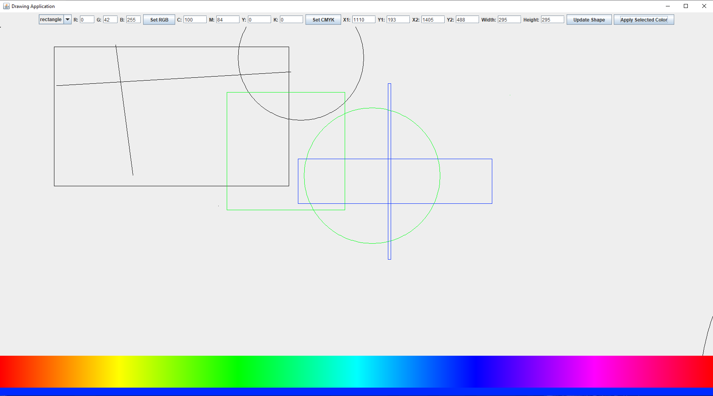

# Introduction
This project is a rudimentary application meant to recreate some of MS Paint's features for educational purposes.
# Usage
The program has several features:
- to draw 3 distinct shapes at will. Lines, rectangles and circles are available,
- to move drawn shapes around by clicking inside of their area and dragging,
- to change the color of new shapes using a gradient color picker or CMYK/RGB manual input,
- to resize the shapes with the coursor or through the text boxes available,
#

